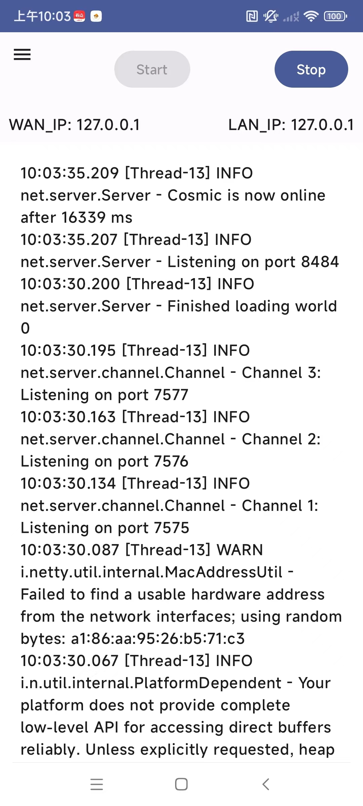
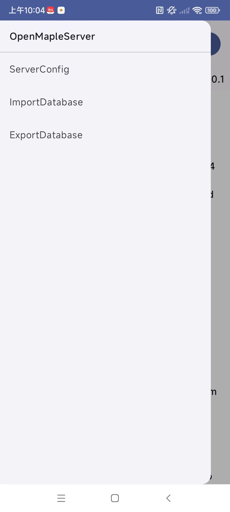

# MapleServerAndroid - MapleStory v83 server on Android

## Introduction
A one-click Maplestory GMS 083 server on Android based on Cosmic project.

## Features
1. Customizable Server Settings: Modify local and lan IP addresses to enable multiplayer capabilities.
2. Database Management: Export and import SQLite-based MapleStory cosmic databases with ease.

## Important
1. Server Startup Time: Please allow approximately 1 minute for the server to start after clicking the Start button.
2. Server Configuration: The server config file is located in assets/config.yaml and is copied to internal app storage during APK installation. You can modify the server config by clicking on Menu->ServerConfig, similar to Cosmic/HeavenMS.  
3. Database Performance: For optimal performance, MySQL has been replaced with SQLite. While I've made efforts to adapt the SQL queries using ChatGPT, there might be some errors. If you encounter any bugs, please report them so we can address them promptly.

Beware - ***This server emulator is not production ready.***
It can be useful for testing things locally or for trying out ideas, but launching a new private server based on this and opening it up to the public
without knowing what you're doing is not recommended.

### Ways to contribute

* Submit a Pull Request (fork -> commit -> PR). If you don't know where to start, have a look at the issues on GitHub.
* Report a bug (preferably as an Issue on GitHub, as reports on Discord may be forgotten or lost)
* Spread the word about Cosmic Android

### Cosmic

- GitHub: https://github.com/P0nk/Cosmic
- Discord: https://discord.gg/JU5aQapVZK

### HeavenMS
- GitHub: https://github.com/ronancpl/HeavenMS
- Discord: https://discord.gg/Q7wKxHX